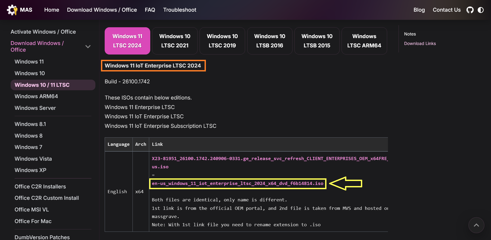

# Preparing the ISO

For starters, we need to get our hands on a clean and bloat-free version of Windows. While there are some popular options like Tiny11 and Ghost Spectre, I found the Windows 11 IoT Enterprise 2024 x64 to be both reliable and trust worthy.

Tiny11 breaks a lot of things and might genuinely not be suitable for non-gamers in day to day use. Meanwhile, Ghost Spectre comes with that veil of anonymity, so you can never be sure if you can trust them.

In choosing Windows 11 IoT Enterprise 2024 x64, we are taking some of that control in our own hands. It's bloat-free by design, and there are some steps we can take to keep it that way even through prolonged use.

## Get the ISO from Massgrave

Getting our hands on the IoT Enterprise LTSC build of Windows 11 can be a little difficult to find directly, but the great folks at Massgrave have already presented a bunch of download links for us.

{: .link }
> [https://massgrave.dev/windows_ltsc_links.html](https://massgrave.dev/windows_ltsc_links.html)

Scroll a little and come to the place marked in the screenshot below.

Now download the ISO using the second link as highlighted in the screenshot above.

Downloading can go a bit faster if you use a download manager like IDM or ABDM.

## Pick a Flashing/Booting Tool

You have several options for preparing the ISO. Pick **ONLY ONE** of the following paths to follow. They are alternative ways of getting the same result.