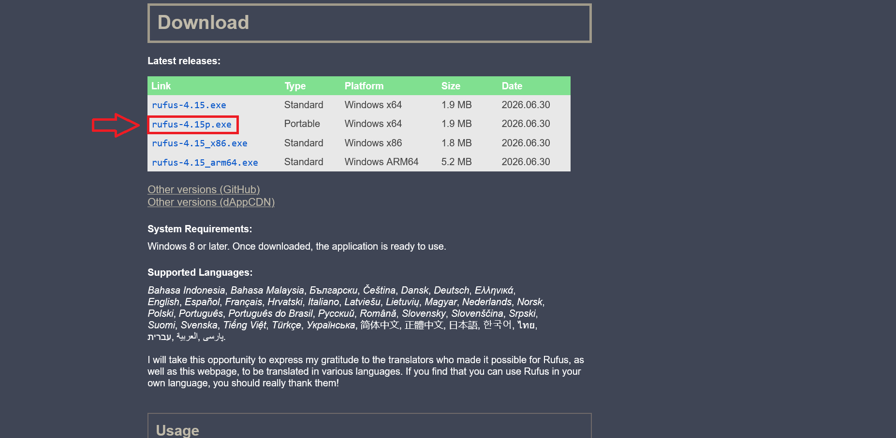
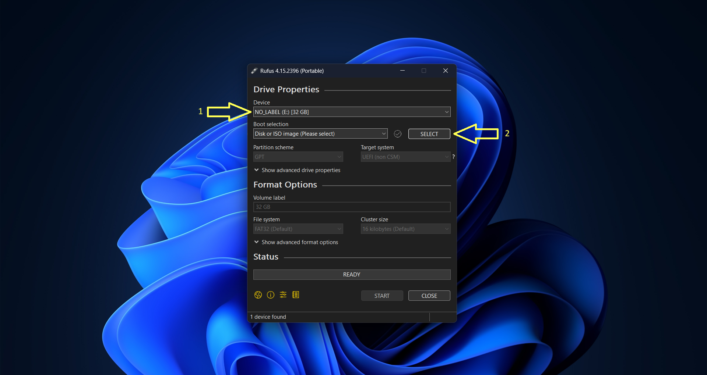
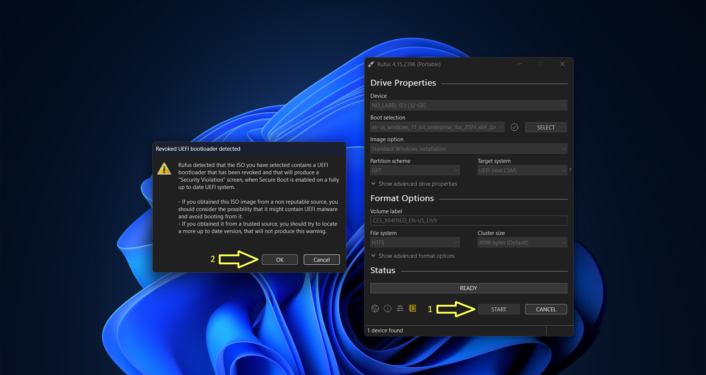
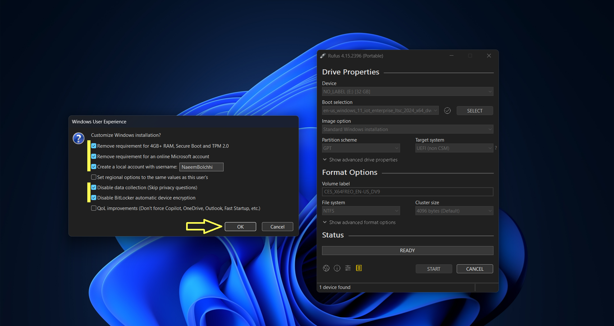
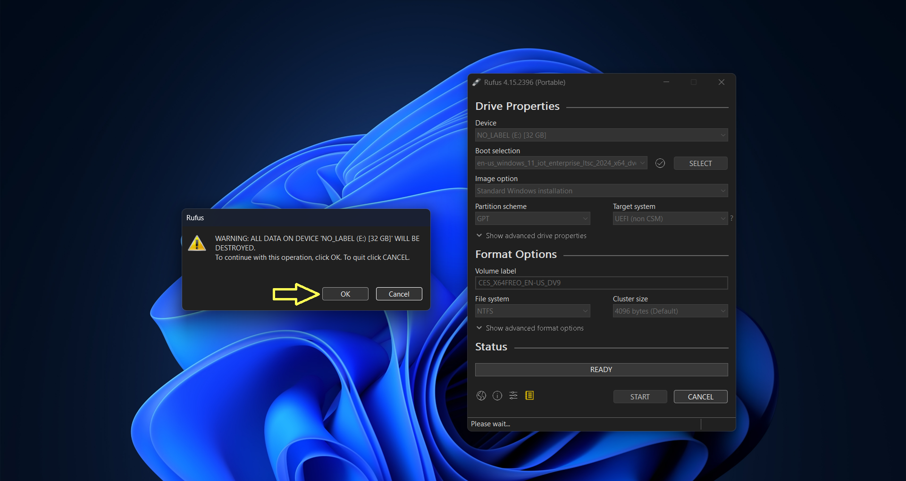
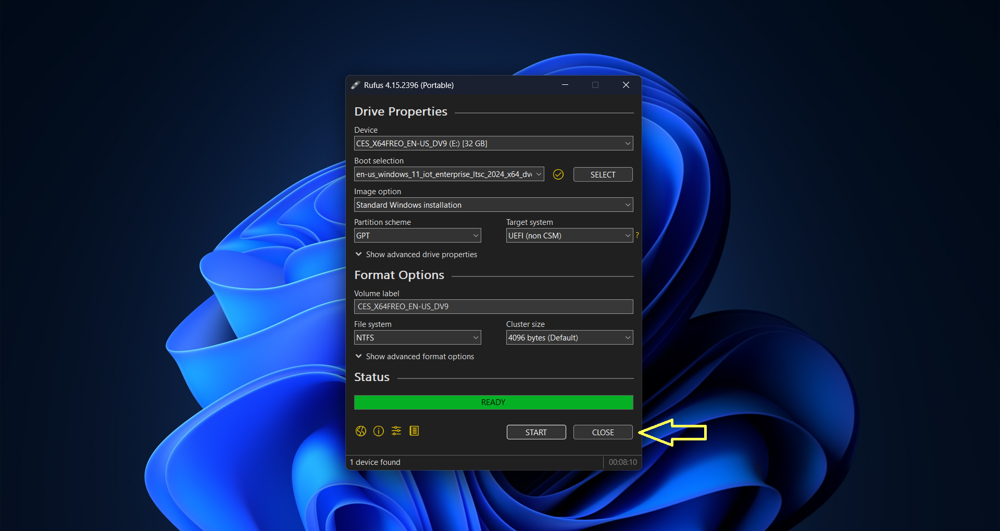

# Downloading and Preparing Windows ISO

In this part of the guide, we will download a bloat-free version of Windows 11, and then use Rufus to make a bootable USB drive.

## Get the ISO from Massgrave

For a clean Windows 11 installation, we need to get our hands on the IoT Enterprise LTSC build of Windows 11. This can be a little difficult to find directly, but the great folks at Massgrave have already presented a bunch of download links for us.

{: .link }
> [https://massgrave.dev/windows_ltsc_links.html](https://massgrave.dev/windows_ltsc_links.html)

Scroll a little and come to the place marked in the screenshot below.

Now download the ISO using the second link as highlighted in the screenshot above.

Downloading can go a bit faster if you use a download manager like IDM or ABDM.

## Download Rufus

Rufus is probably the most light-weight utility available for making a bootable USB drive. There are other popular tools like Balena Etcher, but we will opt for Rufus as it has some simple yet neat modifications available for Windows 11. This is also why we will not be using Ventoy or other similar alternatives.

{: .link }
> [https://rufus.ie/en/#download](https://rufus.ie/en/#download)

Scroll download and download the file marked in the screenshot below.

## Making the Bootable USB Drive

Hope you have a flash drive ready. Rufus works with USB Flash Drives. It's a good idea to get a fast one, as a faster USB Drive will let you install Windows faster as well. But if you're in a pinch, any USB Drive that can hold the contents of the ISO will do.

For starters, run Rufus that you downloaded just now. Ensure that the correct USB Drive is selected (1), then select the ISO you downloaded a while ago (2).

Once that's done, just click **Okay**. Next, you'll get this warning screen. Click **Okay** again. We're adults. We don't need daddy Microsoft to hold our hand as we cross the road.

Now, ensure that you check the same things that I have in the image below. Notice that I have not checked the last one. It'd normally be a good thing, but this particular ISO doesn't have those annoyances to begin with, so it doesn't matter to keep it unchecked. Up to you. Oh, and, set your own username. Don't copy mine, okay?

You'll then get another warning that everything in your USB Drive will be wiped by this process. I want to say that's obvious, but maybe it's your first time? Make sure to move away any important files from your USB Drive if it's not empty.

Now. Let's wait for the process to finish. It can take a while.

Once it's done, you'll see a green background appear on the progress bar with the text "Ready". At this point, we can safely close Rufus as our USB Drive is ready for action.

That's the end for this part.