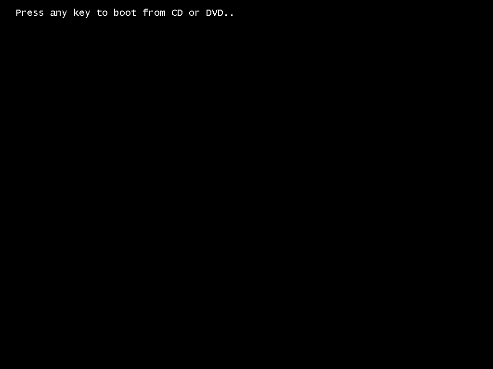

# Booting from USB Drive

This is one area with a wide variation. How you can boot the prepared USB drive in your machine depends largely on the brand of your laptop or motherboard.

Generally, you can do a simple search like, "[How to open boot menu in Gigabyte motherboard](https://duckduckgo.com/?q=How+to+open+boot+menu+in+Gigabyte+motherboard)" or "[How to open boot menu in HP laptop](https://duckduckgo.com/?q=How+to+open+boot+menu+in+HP+laptop)", etc. Change the brand name to match what your machine uses.

If you can't access the boot menu for whatever reason, you can also try to enter the BIOS instead. Search similarly, but mention BIOS instead of boot menu.

In the BIOS, you can set your USB Drive as the first item in boot priority. On most machines, your USB Drive has to be connected for this option to appear.

If you succeed, you may see a screen like the one below.

If you see this screen, you should press something on your Keyboard. Spacebar or Enter will do.

In some cases, this screen may not appear, and the process may direct move to the installation steps. That's normal as well, and is commonly the case when using the boot menu.